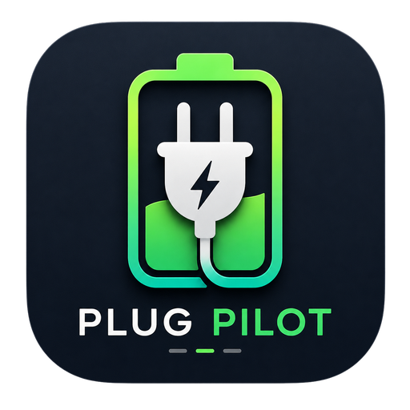

<p align="center">
  
</p>

<h1 align="center">PlugPilot</h1>

<p align="center"><em>Stop worrying about your MacBook battery. PlugPilot does it for you.</em></p>

Plug in at 20%. Unplug at 80%. That's the sweet spot that keeps lithium batteries healthy for years. The problem? Nobody remembers to do it manually.

PlugPilot sits quietly in your menu bar, watches your battery, and tells your Alexa smart plug exactly when to turn on and off — automatically, every day, without you thinking about it.

**No subscription. No cloud. No account except Amazon. Free and open source.**

---

## What it does

- Battery drops below your threshold → plug turns **on** automatically
- Battery rises above your threshold → plug turns **off** automatically
- Works even when your Mac is asleep or the app window is closed
- Manual override anytime with one click

---

## Requirements

- macOS 12 (Monterey) or later — Apple Silicon and Intel
- An Amazon Alexa account
- Any Alexa-compatible smart plug (Amazon Smart Plug, TP-Link Kasa, Meross, etc.)

---


## Setup (takes 2 minutes)

### Before you start — get your smart plug working with Alexa

PlugPilot works with **any Alexa-compatible smart plug**. The only requirement: you must be able to say *"Alexa, turn on my plug"* and have it work before using this app.

1. **Buy any Alexa-compatible smart plug** — [recommended one here](https://amzn.to/4uhD0P3), or any Works with Alexa device
2. **Install the plug's companion app** and follow its setup instructions to connect the plug to your Wi-Fi
3. **Open the Amazon Alexa app** → Devices → Add Device → link your plug to Alexa
4. **Test it** — say "Alexa, turn on [your plug name]" — if it works, you're ready

> Already controlling your plug with Alexa? Skip straight to PlugPilot setup below.

---

### PlugPilot setup

1. Open PlugPilot — the setup wizard appears
2. **Pick your region** — US, India, UK, Canada, Australia, Germany, France, Italy, Spain, Mexico, Brazil, or Japan (pick the one closest to you)
3. **Connect with Amazon** — your browser opens Amazon's login page, sign in once
4. **Select your smart plug** from the list of Alexa devices
5. **Set your battery range** — default is 20% (plug in) to 80% (unplug)
6. Hit **Start Monitoring** — done

The app hides to your menu bar. That's it.

---

## Features

- **Automatic monitoring** — checks battery every 60 seconds, reacts instantly when thresholds change
- **Background worker** — macOS LaunchAgent keeps monitoring even when the UI is closed
- **Manual control** — Plug IN / Plug OUT buttons for override anytime
- **Action history** — full log of every auto and manual action with battery % and timestamp
- **Multi-region** — US, India, UK, Germany, Canada, Japan
- **Dark & light mode** — follows your macOS system theme
- **Run at startup** — optional, launches automatically on login (packaged build only)
- **Menu bar only** — no Dock icon, hides on close, never quits unless you tell it to
- **Delete all data** — one button removes everything the app stored on your system

---

## How it stays secure

| What               | How                                                             |
| ------------------ | --------------------------------------------------------------- |
| Amazon password    | Never stored — your browser handles login                       |
| Session cookies    | Encrypted with Electron `safeStorage` (OS keychain-backed AES)  |
| External URLs      | `open-url` IPC validates `http`/`https` only, nothing else      |
| Renderer isolation | `sandbox: true`, `contextIsolation: true`, no `nodeIntegration` |

---

## File locations

| File                       | Path                                                            |
| -------------------------- | --------------------------------------------------------------- |
| Config / encrypted cookies | `~/Library/Application Support/plugpilot/plugpilot-config.json` |
| Action history             | `~/Library/Application Support/PlugPilot/history.db`            |
| App logs                   | `~/Library/Application Support/PlugPilot/logs/`                 |
| LaunchAgent plist          | `~/Library/LaunchAgents/com.plugpilot.worker.plist`             |

---

## Build from source

### Prerequisites

- Node.js 22.x (`node --version`)
- npm 10+
- macOS 12+

```bash
git clone https://github.com/merohitnishad/Plug-Pilot.git
cd Plug-Pilot
npm install
make start          # compile + launch in dev mode
```

### Dev commands

```bash
make start          # compile TypeScript + launch Electron
make compile        # compile TypeScript only (src/ → electron/)
make build          # compile + package DMG + ZIP for both arm64 and x64
make reset-session  # clear stored cookies + config (forces re-auth)
make reset-logs     # clear all log files
make kill           # kill all running instances + unload LaunchAgent
make clean          # remove compiled electron/ output
```

> `make build` automatically applies ad-hoc code signing so the app runs on your own Mac without Gatekeeper blocking it. For distribution to others, a paid Apple Developer certificate and notarization are required.

---

## License

MIT © [Rohit Nishad](https://rohitnishad.com)

---

## Author

**Rohit Nishad**

- Website: [rohitnishad.com](https://rohitnishad.com)
- GitHub: [@merohitnishad](https://github.com/merohitnishad)
- LinkedIn: [linkedin.com/in/merohitnishad](https://www.linkedin.com/in/merohitnishad/)

---

_PlugPilot is not affiliated with Amazon or Alexa. It uses the unofficial `alexa-remote2` library which relies on undocumented Amazon APIs — session cookies may occasionally expire and require re-login._
